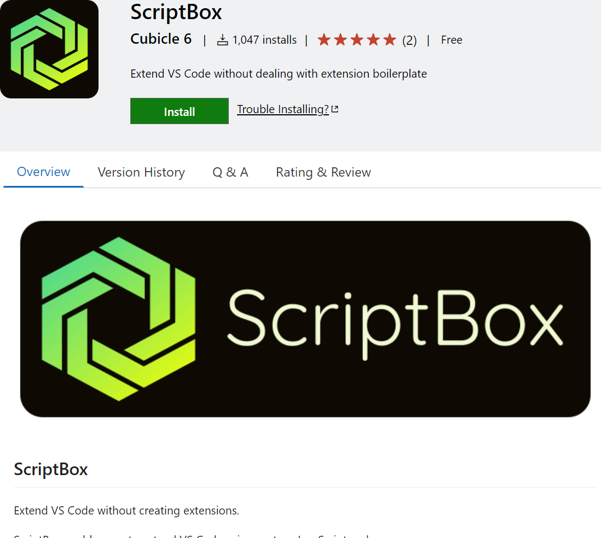
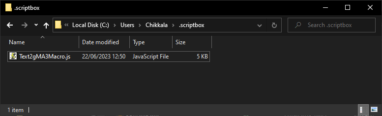
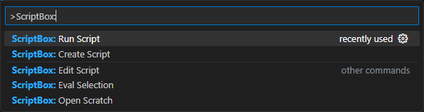

# Text2Macro
Converts text written in VS Code to a simple gMA3 Macro

## VS Code
https://github.com/lukechikkala/Text2Macro/assets/23566967/fe3f8642-7154-40b6-b48f-4790332d5436

1. Install the [ScriptBox](https://marketplace.visualstudio.com/items?itemName=cubicle6.scriptbox) vscode extension.

    

1. Download the [Text2Macro](/VS%20Code/Text2gMA3Macro.js) script from [VS Code](/VS%20Code/) directory of this repository to the following location:
`C:\Users\%USERNAME%\.scriptbox`

    >

1. Open Command Palette (<I> Windows: `Ctrl` + `Shift` + `P` | macOS: `Cmd` + `Shift` + `P`</I> ) in VS Code.

    

1. Type: `>ScriptBox: Run Script`
1. Choose the  `Text2gMA3Macro.js` script from the drop-down.
